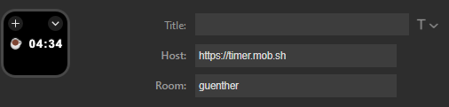

# Stream Deck timer.mob.sh Plugin



A Stream Deck plugin that integrates with [timer.mob.sh](https://timer.mob.sh/) to add timer functionality for mob programming sessions directly to your Stream Deck.

## Features

- Display and control mob programming timers on your Stream Deck
- Start regular mob timers or break timers with a single tap or touch
- Real-time countdown display on Stream Deck buttons
- Configurable room, user name, and timer duration
- Works with both Stream Deck keypads and encoders
- Supports Windows and macOS

## Configuration

After installing the plugin, you can add it to your Stream Deck and configure the following settings:

1. **Host**: The URL of the timer.mob.sh service (default: `https://timer.mob.sh`)
2. **Room**: The name of your mob programming room
3. **Name**: Your username that will be displayed to other participants
4. **Duration in min**: The default timer duration in minutes (default: 10)

## Usage

### Basic Usage

1. Add the "Timer" action to your Stream Deck.
2. Configure the settings as described above.
3. Use the button to control your mob programming sessions:
   - **Tap**: Start a break timer
   - **Long press**: Start a mob timer

### Stream Deck Encoder Support

This plugin also supports Stream Deck encoders with the following functionality:

- **Touch**: Start break timer
- **Long Touch**: Start mob timer
- **Display**: Shows the current timer status and remaining time

### Timer Display

The plugin displays the timer status on your Stream Deck button:
- ⏲️ - Indicates a mob programming timer is running
- ☕ - Indicates a break timer is running
- The remaining time is shown in MM:SS format

## Installation

To install the plugin, follow these steps:

1. Download the latest release artifact from the [Releases](https://github.com/jzlai/streamdeck-mob.sh/releasess) page.
2. Extract the downloaded artifact.
3. Execute the installation file included in the artifact.
4. Follow the on-screen instructions to complete the installation.

Once installed, the plugin will be available in your Stream Deck software.

## Contributing

Contributions to improve the plugin are welcome! Here's how you can contribute:

1. Fork the repository
2. Create a feature branch:
   ```
   git checkout -b feature/your-feature-name
   ```
3. Make your changes
4. Commit your changes:
   ```
   git commit -m "Add some feature"
   ```
5. Push to the branch:
   ```
   git push origin feature/your-feature-name
   ```
6. Open a Pull Request

### Development Environment Setup

1. Install the [Stream Deck SDK](https://developer.elgato.com/documentation/stream-deck/sdk/overview/)
2. Clone this repository
3. Make your changes to the files in the `src` directory
4. Test your changes by:
   - Creating a symbolic link from the plugin directory to your Stream Deck plugins directory
   - OR using the [Stream Deck Distribution Tool](https://developer.elgato.com/documentation/stream-deck/sdk/packaging/) to package and install the plugin

## License

This project is licensed under the MIT License - see the [LICENSE](LICENSE) file for details.
